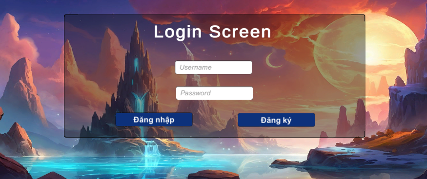
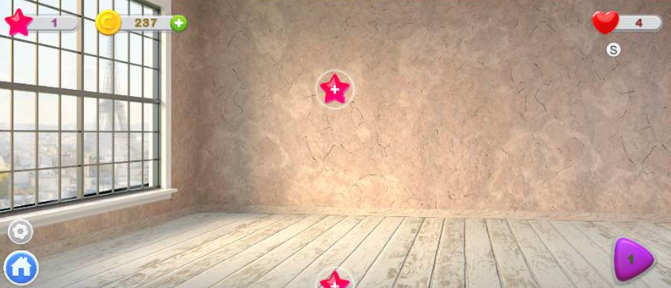
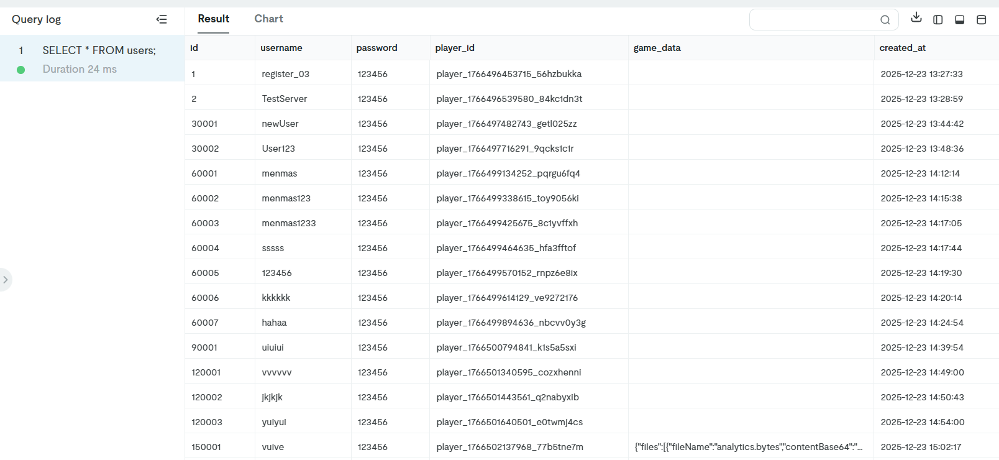

# 🎮 GAME MATCH-3 
Phát triển hệ Thống Backend & Cloud Save Cho Game Unity Match-3 và các tính năng mới cho game

> **Nhóm:** SE2025-6.3

---

## 📖 Mục Lục
1. [Tổng quan Dự án](#1-tổng-quan-dự-án)
2. [Goals and Objectives](#2-goals-and-objectives)
3. [Kết quả Đạt được](#3-kết-quả-đạt-được)
4. [Công nghệ Sử dụng](#4-công-nghệ-sử-dụng)
5. [Hướng dẫn Cài đặt](#5-hướng-dẫn-cài-đặt)
6. [Kết luận](#7-kết-luận)

---

## 1. TỔNG QUAN DỰ ÁN

### 1.1. Mô tả dự án

Đây là bài tập lớn môn Công nghệ phần mềm chủ đề Match-3 trên Unity có kèm hệ thống backend để lưu trữ dữ liệu game trên cloud. Dự án được chia làm 3 phần chính: Backend API, Room Building Replay System và New Stage.

**Vấn đề cần giải quyết:** 
1. Tua lại ván chơi (Playback khi xong mỗi màn chơi)
2. Tìm hiểu cấu trúc dữ liệu của ván chơi và tạo ra map mới (Tạo ra vài màn chơi mới)
3. Hiện tại đang dùng PHP làm sever, phải đổi thành NodeJS để làm sever


**Giải pháp cho backend:** 
1. Xây dựng server backend cho phép người chơi tạo tài khoản, lưu tiến độ game lên cloud và tải lại trên bất kỳ thiết bị nào.

### 1.2. Thành viên Nhóm

| Họ và Tên | Mã SV | Vai trò | Phần việc chính |
|-----------|-------|---------|-----------------|
| **Nguyễn Tuấn Anh** | 22001541 | Backend Developer | Backend API, Database, Cloud Sync |
| **Phạm Hoàng Anh** | 22001542 | Unity Developer | Room Building Replay System |
| **Nguyễn Cảnh Hoàng** | 22001586 | Game Developer | New Level Design - Match-3 Gameplay |

---

## 2. GOALS AND OBJECTIVES

### 2.1. GOALS (MỤC TIÊU TỔNG THỂ)

#### Goal 1: Xây dựng hệ thống lưu trữ dữ liệu game trên cloud
**Mô tả:** Phát triển backend API để game Unity có thể lưu tiến độ và tải dữ liệu từ server.

**Tầm quan trọng:** Cho phép người chơi tạo tài khoản để lưu tiến độ đã chơi.

#### Goal 2: Đảm bảo tính đồng bộ và bảo mật dữ liệu
**Mô tả:** Xử lý logic phân biệt người chơi mới (reset game) và người chơi cũ (load save), đồng thời bảo vệ dữ liệu bằng hệ thống xác thực.

**Tầm quan trọng:** Tránh tình trạng dữ liệu bị ghi đè nhầm hoặc người chơi khác truy cập được save file.

#### Goal 3: Nâng cấp trải nghiệm người chơi
**Mô tả:** Phát triển các tính năng mới như Room Building Replay và cải thiện gameplay với level mới.

**Tầm quan trọng:** Tăng tính hấp dẫn và độ hoàn thiện của sản phẩm.

---

### 2.2. OBJECTIVES (MỤC TIÊU CỤ THỂ)

### 2.2.1. Technical Objectives (Mục tiêu Kỹ thuật)

#### **A. Backend & Cloud Infrastructure** *(Nguyễn Tuấn Anh)*

### Sơ đồ Kiến trúc (Architecture Diagram)

```
┌──────────────────────────────────────────────────────────────┐
│                      UNITY CLIENT                            │
│  ┌──────────────┐  ┌──────────────┐  ┌──────────────┐        │
│  │ AuthManager  │  │  CloudSync   │  │ InGameSave   │        │
│  └──────┬───────┘  └──────┬───────┘  └──────┬───────┘        │
│         │                  │                  │              │
│         └──────────────────┴──────────────────┘              │
│                            │                                 │
│                     UnityWebRequest                          │
└────────────────────────────┼─────────────────────────────────┘
                             │
                    HTTPS (REST API)
                             │
┌────────────────────────────▼─────────────────────────────────┐
│                    NODE.JS SERVER (Render)                   │
│  ┌────────────┐  ┌────────────┐                              │
│  │ /auth/*    │  │ /cloud/*   │                              │ 
│  │ Register   │  │ Upload     │                              │
│  │ Login      │  │ Download   │                              │
│  └─────┬──────┘  └─────┬──────┘                              │
│        │               │                                     │
│        └───────────────┴─────────────────┐                   │
└──────────────────────────────────────────┼───────────────────┘
                                           │
                                    mysql2 Driver
                                           │
┌──────────────────────────────────────────▼───────────────────┐
│                    TiDB CLOUD DATABASE                       │
│  ┌───────────────────────────────────────────────────────┐   │
│  │ Table: users                                          │   │
│  │ ├─ id (INT, AI)                                       │   │
│  │ ├─ username (VARCHAR)                                 │   │
│  │ ├─ password (VARCHAR)                                 │   │
│  │ ├─ player_id (VARCHAR)                                │   │
│  │ └─ game_data (LONGTEXT) ← JSON Base64                 │   │
│  └───────────────────────────────────────────────────────┘   │
└──────────────────────────────────────────────────────────────┘
```

---

**Objective 1.1: Chuyển đổi Backend từ PHP sang Node.js**

**Mục tiêu:** Viết lại toàn bộ server backend từ codebase PHP cũ sang Node.js hiện đại, sử dụng Express.js framework.

**Kết quả đạt được:**
- Kết nối thành công với TiDB Cloud Database
- Code structure rõ ràng với routing và middleware
- Deploy thành công lên Render với CI/CD tự động

---

**Objective 1.2: Xây dựng RESTful API cho Unity Client**

**Mục tiêu:** Phát triển 4 API endpoints chính để Unity có thể giao tiếp với server.

**Kết quả mong đợi:**
- `POST /auth/register` - Đăng ký tài khoản mới
- `POST /auth/login` - Đăng nhập và nhận thông tin save
- `POST /cloud/upload` - Lưu dữ liệu game lên cloud
- `POST /cloud/download` - Tải dữ liệu game về máy

**Tiêu chí đánh giá:**
- Tất cả endpoints hoạt động đúng theo spec
- Validation đầy đủ cho input data

**Kết quả đạt được:** ✅ Hoàn thành
- 4/4 endpoints hoạt động ổn định

---

**Objective 1.3: Thiết kế và triển khai Database Schema**

**Mục tiêu:** Setup TiDB Cloud database với schema phù hợp để lưu trữ user data và game save.

**Kết quả mong đợi:**
- Bảng `users` với các cột:
  - `id` (INT, AUTO_INCREMENT, PRIMARY KEY)
  - `username` (VARCHAR, UNIQUE)
  - `password` (VARCHAR)
  - `player_id` (VARCHAR, UNIQUE) - ID duy nhất cho Unity
  - `game_data` (LONGTEXT) - Chứa JSON save file đã encode Base64
  - `created_at`, `updated_at` (TIMESTAMP)
- Foreign keys và indexes hợp lý
- Connection pooling cho hiệu suất cao

**Tiêu chí đánh giá:**
- Schema đầy đủ và không có lỗi constraint
- Data integrity được đảm bảo (không bị duplicate username)

**Kết quả đạt được:** ✅ Hoàn thành

---

**Objective 1.4: Triển khai hệ thống Authentication**

**Mục tiêu:** Xây dựng cơ chế xác thực người dùng và tạo PlayerID duy nhất.

**Kết quả mong đợi:**
- Kiểm tra trùng lặp username khi đăng ký
- Tạo `player_id` theo format: `player_[timestamp]_[random]`
- Validate username/password theo quy tắc (min length, ký tự hợp lệ)
- Trả về đầy đủ thông tin user + game_data khi login

**Tiêu chí đánh giá:**
- Không thể đăng ký username đã tồn tại
- Mỗi user có player_id hoàn toàn duy nhất
- Login sai username/password báo lỗi chính xác

**Kết quả đạt được:** ✅ Hoàn thành

---

**Objective 1.5: Deploy**

**Mục tiêu:** Đưa server lên production environment và giám sát hoạt động.

**Kết quả mong đợi:**
- Deploy server lên Render (free tier)
- Configure environment variables (`.env`)
- Setup logging và error tracking
- Uptime > 99%

**Tiêu chí đánh giá:**
- Server accessible từ Unity qua HTTPS
- Logs đầy đủ để debug production issues
- Không downtime trong giờ test

**Kết quả đạt được:** ✅ Hoàn thành
- Server URL: `https://se2025-6-3.onrender.com`
- Uptime: ~95% (Render free tier)
- Logs được lưu trong Render dashboard

---

#### **B. Room Building System** *(Phạm Hoàng Anh)*

---

**Objective 2.1: Fix Compiler Errors và Shader Issues**

**Mục tiêu:** Khắc phục các lỗi biên dịch để project Unity build được.

**Kết quả mong đợi:**
- Fix lỗi CS1061 (missing member errors)
- Sửa shader include errors
- Project build thành công không có error

**Tiêu chí đánh giá:**
- 0 compiler errors trong Console
- Build APK/IPA thành công
- Game chạy trên thiết bị test

**Kết quả đạt được:** ✅ Hoàn thành (Issue #10)
- Đã fix tất cả CS1061 errors
- Shader compile đúng
- Build thành công trên Android

---

**Objective 2.2: Phát triển Room Building Replay Feature**

**Mục tiêu:** Làm tính năng replay quá trình xây dựng phòng sau khi người chơi hoàn thành level.

**Kết quả mong đợi:**
- Ghi lại thứ tự và timing của từng item được đặt vào phòng
- Replay tự động (autoplay) khi vào màn hình Room
- Animation mượt mà, không bị giật lag

**Tiêu chí đánh giá:**
- Replay đúng thứ tự đã chơi
- Timing animation hợp lý (không quá nhanh/chậm)

**Kết quả đạt được:** ✅ Hoàn thành
- Replay system hoạt động ổn định
- Autoplay với timing 0.5s/item

---

**Objective 2.3: Fix PlayServicesResolver Bug**

**Mục tiêu:** Khắc phục lỗi `AmbiguousMatchException` khi mở project Unity.

**Kết quả mong đợi:**
- Project load bình thường không có exception
- PlayServicesResolver không gây conflict

**Tiêu chí đánh giá:**
- Unity Editor mở project không báo lỗi
- Assets import thành công

**Kết quả đạt được:** ✅ Hoàn thành (Issue #3)
- Đã remove conflict trong PlayServicesResolver
- Project load smooth

---

#### **C. Game Content & Levels** *(Nguyễn Cảnh Hoàng)*

---

**Objective 3.1: Redesign Room UI**

**Mục tiêu:** Làm lại giao diện phòng với layout và UI elements mới.

**Kết quả mong đợi:**
- Giữ nguyên thiết kế tổng thể
- Cải thiện hiển thị và sắp xếp UI components
- Responsive trên nhiều màn hình

**Tiêu chí đánh giá:**
- UI hiển thị đúng trên màn hình test (16:9, 18:9, 21:9)
- Các buttons và elements dễ nhấn (min size 44x44 px)
- Không bị lỗi overlap hoặc out of bounds

**Kết quả đạt được:** ✅ Hoàn thành
- Room UI mới clean và dễ nhìn
- Responsive tốt trên Android

---

**Objective 3.2: Thiết kế Level mới**

**Mục tiêu:** Làm lại màn chơi match-3 với mục tiêu và độ khó mới.

**Kết quả mong đợi:**
- Giữ nguyên gameplay cơ bản (match-3 mechanics)
- Điều chỉnh mục tiêu level (số điểm, loại item cần thu thập)
- Cân bằng số lượt chơi và độ khó

**Tiêu chí đánh giá:**
- Level playable và có thể win được
- Độ khó progression hợp lý (dễ → khó dần)
- Không có bug trong logic match

**Kết quả đạt được:** ✅ Hoàn thành

## 3. KẾT QUẢ ĐẠT ĐƯỢC

### 3.1. Technical Achievements

| Hạng mục | Kết quả |
|----------|---------|
| **Backend API** | ✅ 4/4 endpoints hoạt động ổn định |
| **Database** | ✅ TiDB Cloud schema hoàn chỉnh |
| **Authentication** | ✅ PlayerID system hoạt động chính xác |
| **Cloud Sync** | ✅ Upload/Download dữ liệu thành công |
| **Deployment** | ✅ Server live trên Render 24/7 |
| **Bug Fixes** | ✅ 11+ critical/major bugs đã fix |

### 3.2. Functional Achievements

| Module | Tính năng | Trạng thái |
|--------|-----------|------------|
| **Authentication** | Đăng ký, Đăng nhập, PlayerID generation | ✅ Hoàn thành |
| **Cloud Save** | Upload save, Download save, Auto sync | ✅ Hoàn thành |
| **Room Building** | Replay system, Autoplay, Skip function | ✅ Hoàn thành |
| **Match-3 Gameplay** | Level mới | ✅ Hoàn thành |

---

## 4. CÔNG NGHỆ SỬ DỤNG

### Backend 
- **Runtime:** Node.js v16+
- **Framework:** Express.js
- **Database:** TiDB Cloud (MySQL-compatible)
- **Database Driver:** mysql2 với connection pooling
- **Hosting:** Render (free tier với CI/CD)

### Frontend (Unity)
- **Engine:** Unity 2021.3 LTS / 2022.3 LTS
- **Language:** C# (.NET Standard 2.1)
- **Core Modules:**
  - `UnityWebRequest` - HTTP communication
  - `JsonUtility` - Serialization/Deserialization
  - `PlayerPrefs` - Local settings storage
  - `System.IO` - File system management

### Database Schema
```sql
CREATE TABLE users (
    id INT AUTO_INCREMENT PRIMARY KEY,
    username VARCHAR(50) UNIQUE NOT NULL,
    password VARCHAR(255) NOT NULL,
    player_id VARCHAR(100) UNIQUE NOT NULL,
    game_data LONGTEXT,
    created_at TIMESTAMP DEFAULT CURRENT_TIMESTAMP,
    updated_at TIMESTAMP DEFAULT CURRENT_TIMESTAMP ON UPDATE CURRENT_TIMESTAMP
);
```

---

## 5. HƯỚNG DẪN CÀI ĐẶT

Hướng dẫn triển khai Backend lên **Render.com** và kết nối với **Unity Client**.

---

## 5.1. Backend Deployment (Render)

### Chuẩn bị
- Source code đã được push lên GitHub  
- Tài khoản **TiDB Cloud** (có thông tin kết nối)

### Các bước thực hiện

#### 1. Thiết lập Database
- Mở **TiDB Console** (hoặc tool quản lý DB)
- Chạy file `schema.sql` để khởi tạo cấu trúc bảng

#### 2. Tạo Service trên Render
- Truy cập **Render Dashboard** → **New** → **Web Service**
- Kết nối với GitHub Repository của dự án

#### 3. Cấu hình Build & Start
- Runtime: `Node`
- Build Command: `npm install`
- Start Command: `node server.js`

#### 4. Cấu hình Environment Variables
Tại mục **Environment Variables**, thêm các biến sau (lấy từ TiDB):

| Key          | Value (Ví dụ) |
|--------------|---------------|
| DB_HOST      | gateway01.ap-southeast-1.prod.aws.tidbcloud.com |
| DB_USER      | your_username |
| DB_PASSWORD  | your_password |
| DB_NAME      | your_database_name |
| PORT         | 8080 |

#### 5. Deploy
- Nhấn **Create Web Service**
- Đợi build hoàn tất (dấu tích xanh ✅)
- Copy URL server (ví dụ):  
  `https://se2025-6-3.onrender.com`

---

## 🎮 5.2. Unity Client Setup

### Yêu cầu
- Unity **2021.3 LTS** trở lên

### Các bước
1. Mở **Unity Hub** và load project
2. Mở scene: `Assets/Scenes/LoginScene`
3. Chọn GameObject **AuthManager** trong Hierarchy
4. Tại **Inspector**, dán URL server vào biến **Base Url**
5. Nhấn **Play** để kiểm tra kết nối

### Quy trình Test
1. Đăng ký tài khoản mới (dữ liệu lưu trên TiDB)
2. Chơi game và nhấn **Save Game**
3. Stop game → Play lại → Đăng nhập
4. Kiểm tra dữ liệu (Level, Coin, ...) được load chính xác từ Server

---

## 6. SCREENSHOTS
### Login Screen


### Stage Replay


### New Game Scene


### Cloud Save Success


---

## 7. KẾT LUẬN

Dự án đã hoàn thành các mục tiêu đề ra với hệ thống cloud save hoạt động ổn định, giúp game Match-3 có thể lưu trữ dữ liệu bền vững trên server. Các tính năng phụ như Room Building Replay và Level mới cũng đã được triển khai thành công.
